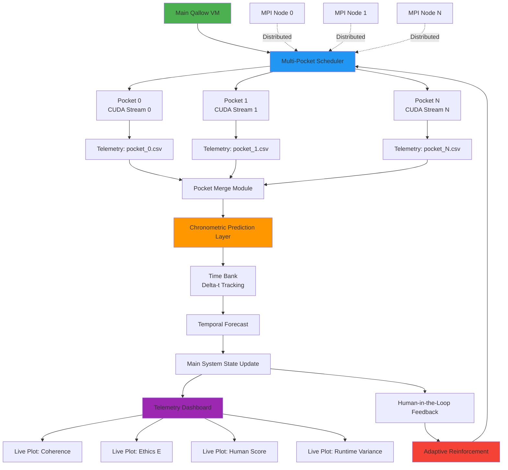

# Phase IV - Predictive System Expansion Architecture

## System Flow Diagram



## Phase IV Components

### 1. Multi-Pocket Scheduler
- Parallel CUDA stream execution
- N independent worldlines
- Per-pocket parameter variations
- Concurrent telemetry collection

### 2. Chronometric Prediction Layer
- Temporal offset learning
- Delta-t confidence tracking
- Drift anticipation algorithms
- Forecast horizon management

### 3. Pocket Merge Module
- Probabilistic result aggregation
- Weighted confidence merging
- Outlier detection and filtering
- Consensus-based state selection

### 4. Telemetry Dashboard
- Real-time visualization
- Multi-metric plotting
- Trend analysis
- Alert generation

### 5. Distributed Node Support
- MPI communication layer
- Cross-node pocket synchronization
- Distributed result merging
- Network telemetry

## Data Flow

```
Main VM → Scheduler → [Pocket0, Pocket1, ..., PocketN]
                              ↓          ↓           ↓
                         [Stream0]  [Stream1]   [StreamN]
                              ↓          ↓           ↓
                         [CSV_0]    [CSV_1]     [CSV_N]
                              ↓          ↓           ↓
                              └──────────┴───────────┘
                                         ↓
                                  Merge Results
                                         ↓
                              Chronometric Analysis
                                         ↓
                                  Time Bank Update
                                         ↓
                              Temporal Forecast
                                         ↓
                              Main State Update
                                         ↓
                           ┌─────────────┴─────────────┐
                           ↓                           ↓
                    Dashboard Viz              HITL Feedback
                           ↓                           ↓
                    User Observation          Adaptive Tuning
```

## Implementation Order

1. ✅ Phase III Complete - Adaptive Intelligence Layer
2. 🔵 Multi-Pocket Scheduler (In Progress)
3. ⚪ Chronometric Prediction Layer
4. ⚪ Expanded Telemetry Dashboard
5. ⚪ Distributed Node Preparation

## Key Metrics Tracked

| Metric | Source | Purpose |
|--------|--------|---------|
| Global Coherence | All Pockets | System stability |
| Decoherence Level | Per-Pocket | Divergence detection |
| Ethics Score (E) | Main + Pockets | Safety monitoring |
| Delta-t | Chronometric Layer | Temporal accuracy |
| Confidence | Time Bank | Prediction quality |
| Runtime Variance | Scheduler | Performance tuning |
| Human Score | HITL | User satisfaction |
| Thread Efficiency | Adaptive Module | Resource optimization |

## Pocket Dimension Worldlines

Each pocket simulates a parallel probabilistic path:

```
Main Timeline:    ──────────────────────────────>
                         ↓
Pocket 0:         ─────●═══●═══●─────  (params_0)
Pocket 1:         ─────●═══●═══●─────  (params_1)
Pocket 2:         ─────●═══●═══●─────  (params_2)
                         ↓
                    Merge Point
                         ↓
              Probabilistic Consensus
                         ↓
                  Updated Main State
```

## Chronometric Time Bank

Tracks temporal prediction accuracy:

```
Observed Event Time: T_obs
Predicted Event Time: T_pred
Delta-t = T_obs - T_pred
Confidence = 1.0 - |Delta-t| / T_horizon

Bank Update:
  - If |Delta-t| < threshold: Increase confidence
  - If |Delta-t| > threshold: Decrease confidence, adjust model
  - Learn temporal offset patterns over time
```

## Phase IV Success Criteria

- [ ] Multi-Pocket Scheduler runs N>=4 parallel streams
- [ ] Per-pocket telemetry files generated
- [ ] Merge algorithm produces consensus state
- [ ] Chronometric layer tracks delta-t with confidence
- [ ] Time Bank learns temporal patterns
- [ ] Dashboard displays real-time metrics
- [ ] Distributed stub compiles with MPI flags
- [ ] End-to-end predictive cycle completes

---

**Next Steps:** Implement Multi-Pocket Scheduler with CUDA streams
