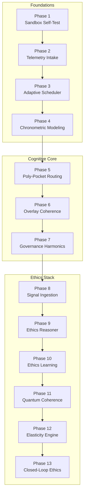
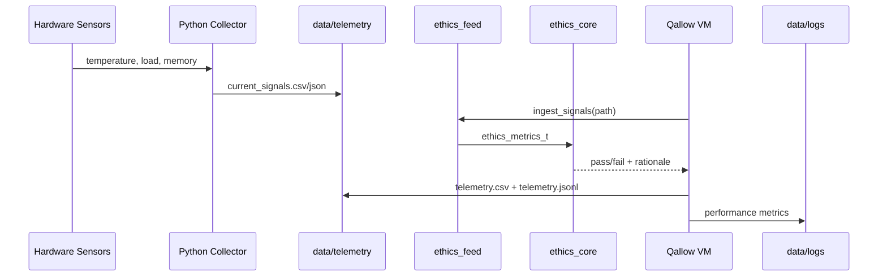
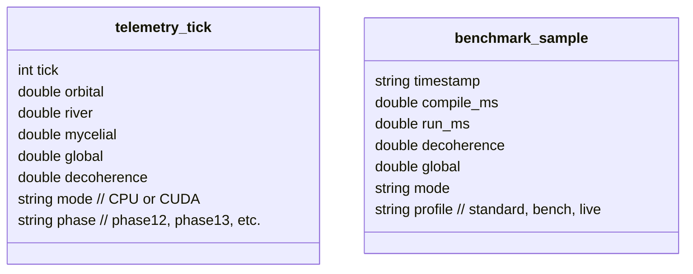
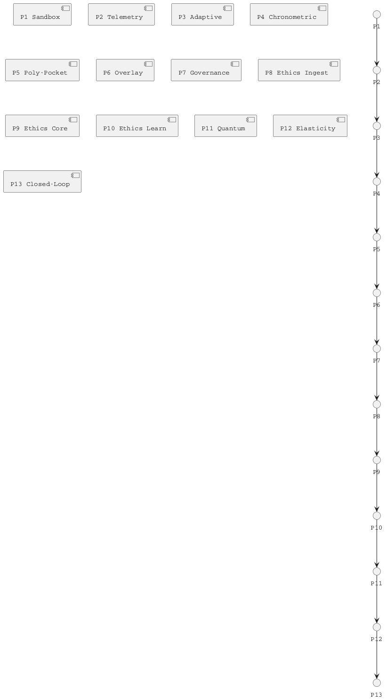

# Qallow Architecture Specification

This document consolidates the legacy phase roadmaps into a single reference. Each phase of the Qallow stack builds toward an ethics-governed autonomous runtime capable of blending photonic simulation, quantum propagation, and human feedback loops.

## System Topology

## Phase Reference Table

| Phase | Module | Key Headers | Primary Inputs | Outputs | Notes |
| --- | --- | --- | --- | --- | --- |
| 1 | Sandbox bootstrap | `sandbox.h` | Diagnostics harness, self-test vectors | PASS/FAIL readiness | Creates baseline runtime guarantees. |
| 2 | Telemetry ingestion | `telemetry.h`, `ingest.h` | Hardware metrics, CSV streams, operator JSON | Normalized telemetry sample | Populates `telemetry_packet_t` for downstream consumers. |
| 3 | Adaptive scheduler | `adaptive.h` | Telemetry-derived cadence, human score | Updated thread count, latency targets | Saves state to `adapt_state.json`. |
| 4 | Chronometric modeling | `chronometric.h` | Event ticks, predicted timings | Confidence-weighted deltas | Feeds overlay pacing logic. |
| 5 | Poly-Pocket routing | `ppai.h`, `pocket.h` | Multi-pocket state vector | Balanced overlay distribution | GPU-accelerated when CUDA is enabled. |
| 6 | Overlay coherence | `overlay.h` | Decoherence metrics, governance weights | Stabilized overlay matrix | Maintains harmonic alignment across pockets. |
| 7 | Governance harmonics | `govern.h`, `phase7.h` | Node adjacency, ethics priors | Harmonic energy distribution | Coordinates CPU/GPU execution path. |
| 8 | Ethics signal ingestion | `ethics_feed.c`, `ethics_learn.c` | Human feedback, system vitals | `ethics_metrics_t` sample | Converts raw telemetry to normalized ethics scores. |
| 9 | Ethics reasoning | `ethics_core.c` | Metrics snapshot, thresholds | PASS/FAIL + rationale | Implements E = S + C + H. |
| 10 | Ethics learning loop | `ethics_learn.c` | Historical verdicts, deltas | Updated priors, threshold adjustments | Supports online adaptation. |
| 11 | Quantum coherence kernels | `backend/cuda/*.cu` | Photonic node states | Coherence matrices, decoherence metrics | Optional CUDA acceleration. |
| 12 | Elasticity engine | `phase12_elasticity.c`, `qallow_phase12.h` | Ticks, epsilon | Equilibrium metrics, energy curvature | CPU baseline with optional CUDA acceleration hooks. |
| 13 | Closed-loop ethics accelerator | `phase13_harmonic.c`, `ethics_feed.c` | Phases 8-12 outputs, human audit | Ethics audit log, mitigation triggers | Runs continuous verification; integrated with profiling and telemetry exports. |

See `docs/QUICKSTART.md` for runtime dependencies, environment variables, and build recipes.

## Data Flow

## Module Boundaries

- `core` headers define public structs and interfaces. Exported headers live in both `core/include` and `include/qallow` for downstream packaging.
- `backend/cpu` and `backend/cuda` implement the heavy compute paths. The CUDA backend is optional and toggled via `QALLOW_ENABLE_CUDA`.
- `algorithms` contains deterministic components: ethics computations, probabilistic updates, and ingestion adaptors.
- `src/runtime` houses cross-cutting infrastructure (logging, profiling, filesystem helpers).
- `interface` provides CLI applications (`qallow`, `qallow_unified`, phase runners).

## Telemetry Schema

All telemetry and benchmark files adopt the canonical schema below (see also `docs/QUICKSTART.md`).

## Phase Dependencies

## Build Targets

- `qallow_core` (INTERFACE) – Exposes headers and common compile definitions.
- `qallow_algorithms` – Ethics and learning modules.
- `qallow_backend_cpu` – CPU-only execution path.
- `qallow_backend_cuda` – CUDA kernels (optional).
- `qallow_runtime` – Logging, profiling, filesystem utilities.
- `qallow` / `qallow_unified` – CLI applications.
- `qallow_examples` – Phase demos, benchmarks.

## Versioning

The canonical manifest lives in `config/manifest.json` and is incremented per release. All binaries embed the manifest information via `qallow_version_get()` (see `include/qallow/version.h`).
